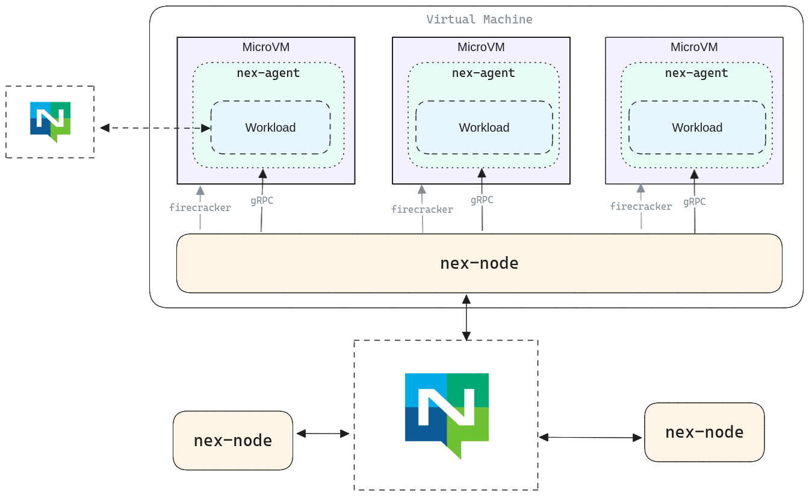

# NATS Execution Engine
Turn your NATS infrastructure into a distributed workload deployment and execution engine.

* [nex-agent](./nex-agent) - Agent that runs inside a Firecracker VM, responsible for running untrusted workloads. Not something end users need to interact with.
* [nex-node](./nex-node) - Service running on a NEX node. Exposes a control API, starts/stops firecracker processes, communicates with the agent inside each process.
* [control-api](./control-api/) - The API for communicating with and remotely controlling NEX nodes
* [nex-cli](./nex-cli) - CLI for communicating with NEX nodes
* [fc-image](./fc-image/) - Tools for building the rootfs (ext4) file system for use in firecracker VMs
* [agent-api](./agent-api/) - Data types and other API data for protocol used between `nex-node` and `nex-agent` across the firecracker boundary. This is an internal API unlikely to be of interest to anyone other than contributors.

Follow these steps to get up and running:

1. Build and launch a [nex-node](./nex-node/) instance. See the repo for configuration and deployment instructions. At the very least, you'll need:
    * CNI configuration and plugins installed
    * A linux kernel binary available
    * A root file system (`ext4`) for the firecracker VMs
1. Push your statically linked linux binary to a NATS object store
1. Use the [nex-cli](./nex-cli) or the [control-api](./control-api/) to launch a workload. For this, you'll need:
    * An xkey used by the publisher
    * An nkey used to "issue" the workload (by convention, this is an account)
    * A set of environment variables to pass into the workload at startup
    * The URL of the workload in the format `nats://{object-store}/{key}`. This corresponds to where you uploaded the file in step 2. The `nex-node` must be able to pull from this store
1. Monitor events and logs on `$NEX.events.*` and `$NEX.logs.>`

**NOTE** that if your workload needs a NATS connection (or any other connection), not only will the firecracker CNI need to allow it, but you'll need to pass that URL/credentials/etc into the workload via the environment variables specified in the launch request.

## Supported Workloads
In order to create a deployable workload, you'll need to create a _statically linked_ executable compiled for 64-bit Linux. Creating a truly statically linked executable file can be tricky. The following shows how to do it in Go (run this in a directory with a `main.go` file):

```go
go build -tags netgo -ldflags '-extldflags "-static"'
```

Building a statically linked 🦀 Rust binary involves using cargo to build against the `x86_64-unknown-linux-musl` target (or `aarch64` if you've deployed `nex-node` on ARM/Apple).

For other languages, check the language documentation or community.

Once your static executable is ready to run, you can use the [CLI](./nex-cli/) or the [Control API](./control-api/) to launch it. The system will validate that the binary is statically linked and reject it otherwise.

## Architecture
The following diagram provides a (rough) view of the various components of the system. Here, `nex-node` processes all attach to a NATS system. Each `nex-node` process is responsible for spinning up multiple firecracker VMs. Within each firecracker VM is a `nex-agent` process, and spawned by each `nex-agent` process is a _single_, untrusted workload (executable). 

In production, if an untrusted workload has a NATS connection, it should not use the same URL+credentials that the node servers are using. Remember that credentials and URLs are all passed to workloads through encrypted environment variables.

