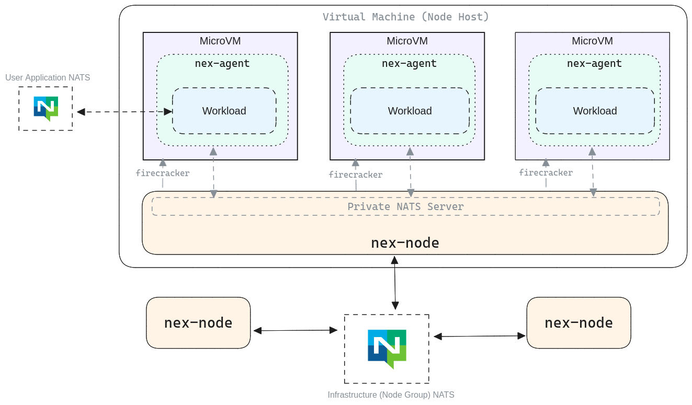

# NATS Execution Engine Architecture
The following diagram provides a (rough) view of the various components of the system. Here, `nex node` processes all attach to a NATS system. Each `nex node` process is responsible for spinning up multiple firecracker VMs. Within each firecracker VM is a `nex-agent` process, and spawned by each `nex-agent` process is a _single_, untrusted workload (executable). 

In production, if an untrusted workload has a NATS connection, it should not use the same URL+credentials that the node servers are using. Remember that credentials and URLs are all passed to workloads through encrypted environment variables.

